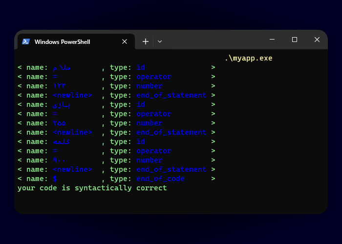

# یک تحلیلگر لغوی و نحوی

این برنامه حروف فارسی، اعداد فارسی و علامت مساوی را از یک فایل utf-8 می‌خواند؛
سپس با بررسی آن به ما می‌گوید که آن نویسه‌ها یک شناسه، عدد یا عملگر است.

در این برنامه از دو کتابخانه fmt و Unicode Algorithms Implementation استفاده شده است.

